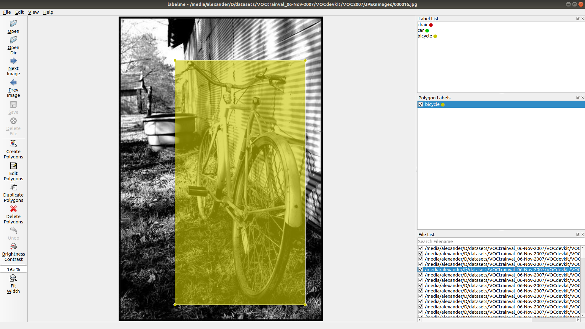

### pascal

Python utility to work with PascalVoc annotation format

Image examples from [PascalVoc2007](hhttp://host.robots.ox.ac.uk/pascal/VOC/voc2007/) dataset

#### Code Examples

##### Read annotation from xml file

```
from pathlib import Path

import cv2
from pascal import PascalVOC

ds = Path("./datasets/VOCtrainval_06-Nov-2007/VOCdevkit/VOC2007/Annotations")
img_path = Path("./datasets/VOCtrainval_06-Nov-2007/VOCdevkit/VOC2007/JPEGImages")

if __name__ == '__main__':
    for file in ds.glob("*.xml"):
        ann = PascalVOC.from_xml(file)
        img = cv2.imread(str(img_path / ann.filename))
        for obj in ann.objects:
            p1 = (obj.bndbox.xmin, obj.bndbox.ymin)
            p2 = (obj.bndbox.xmax, obj.bndbox.ymin)
            p3 = (obj.bndbox.xmax, obj.bndbox.ymax)
            p4 = (obj.bndbox.xmin, obj.bndbox.ymax)
            cv2.line(img, p1, p2, color=(0, 255, 0), thickness=3)
            cv2.line(img, p2, p3, color=(0, 255, 0), thickness=3)
            cv2.line(img, p3, p4, color=(0, 255, 0), thickness=3)
            cv2.line(img, p4, p1, color=(0, 255, 0), thickness=3)
        cv2.imshow("Image", img)
        cv2.waitKey(0)
        cv2.destroyAllWindows()
```

##### Make annotation

```
from pascal import PascalVOC, PascalObject, BndBox, size_block

if __name__ == '__main__':
    obj = PascalObject("chair", "Rear", truncated=False, difficult=False, bndbox=BndBox(263, 211, 324, 339))
    pascal_ann = PascalVOC("000005.jpg", size=size_block(500, 375, 3), objects=[obj])
    pascal_ann.save("000005.xml")
```

##### Convert to [labelme](https://github.com/wkentaro/labelme) format

```
from pathlib import Path
import json

from pascal import PascalVOC

ds = Path("./datasets/VOCtrainval_06-Nov-2007/VOCdevkit/VOC2007")
annotations = ds / "Annotations"
img_path = ds / "JPEGImages"
out = ds / "label_me"

if __name__ == '__main__':
    for file in annotations.glob("*.xml"):
        ann = PascalVOC.from_xml(file)
        lbl_me = ann.to_labelme(img_path, save_img_data=False)
        with open(out / f"{file.stem}.json", "w") as f:
            json.dump(lbl_me, f)
```



##### Convert to YOLO format

```
from pathlib import Path

from pascal import PascalVOC

ds = Path("xmls")

label_map = {
    "plate": 0,
    "other": 1,
    "taxi": 2,
    "standard": 3
}

if __name__ == '__main__':
    for file in ds.glob("*.xml"):
        ann = PascalVOC.from_xml(file)
        yolo = ann.to_yolo(label_map)
        out_name = f"{file.stem}.txt"
        with open(out_name, "w") as f:
            f.write(yolo)
```

#### Installation

```
python setup.py install
```
