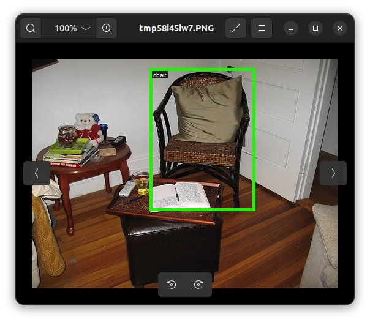

### pascal

Python utility to work with PascalVoc annotation format

Image examples from [PascalVoc2007](hhttp://host.robots.ox.ac.uk/pascal/VOC/voc2007/) dataset

##### Code Example

```
import json
from pathlib import Path

from PIL import Image

from pascal import annotation_from_xml
from pascal.utils import save_xml

ds_path = Path("/home/VOCtest_06-Nov-2007/VOCdevkit/VOC2007")

img_src = ds_path / "JPEGImages"
ann_src = ds_path / "Annotations"

out_labelme = ds_path / "converted_labelme"

attr_type_spec = {"truncated": bool, "difficult": bool}

label_map = {"car": 1, "dog": 0, "person": 2, "train": 3}

if __name__ == "__main__":
    for file in img_src.glob("*.jpg"):
        # Get annotation file path
        ann_file = (ann_src / file.name).with_suffix(".xml")
        # Make pascal annotation object
        ann = annotation_from_xml(ann_file, attr_type_spec)
        print(ann)
        # Save to xml file (same as ann_file)
        xml = ann.to_xml()
        out_xml_name = file.with_suffix(".xml").name
        save_xml(out_xml_name, xml)
        # Save yolo annotation
        yolo_ann = ann.to_yolo(label_map)
        out_yolo_name = file.with_suffix(".txt").name
        with open(out_yolo_name, "w") as f:
            f.write(yolo_ann)
        # Convert to labelme and save json file
        res = ann.to_labelme(file, save_img_data=False)
        with open((out_labelme / file.name).with_suffix(".json"), "w") as f:
            json.dump(res, f, indent=2)
        # Draw objects
        img = Image.open(file)
        draw_img = ann.draw_boxes(img)
        draw_img.show()
```

##### Visualization example:
```
draw_img = ann.draw_boxes(img)
draw_img.show()
```


#### Installation
From source 
```
python setup.py install
```
Using pip
```
pip install pascal-voc
```